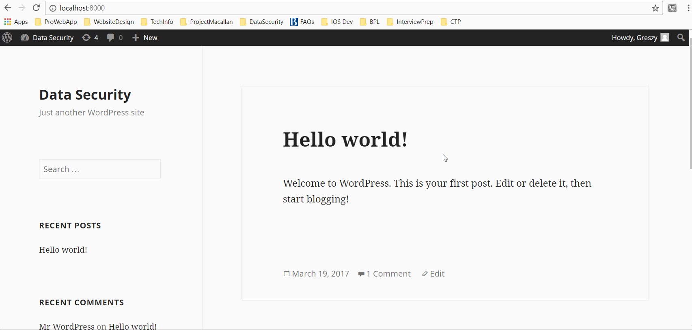

# Project 7 - WordPress Pentesting

Time spent: **10** hours spent in total

> Objective: Find, analyze, recreate, and document **five vulnerabilities** affecting an old version of WordPress

## Pentesting Report

1. (Required) Authenticated Stored Cross-Site Scripting
  - [x] Summary: 
    - Vulnerability types: XSS
    - Tested in version: 4.2.2
    - Fixed in version: 4.2.3
  - [x] GIF Walkthrough: 
  - [x] Steps to recreate: 
   1. Press edit on a created post. 
   2. Switch to text mode. 
   3. Type in an html script like for example: <a href="[caption code=">]</a><a title=" onmouseover=alert('test')  ">link</a>
   4. Save the changes. Go back to your website and mouse over the created link. The added call to a javascript function should appear. 
  - [x] Affected source code:
    - [Link 1](https://core.trac.wordpress.org/browser/tags/4.2.2/src/wp-includes/kses.php)
    - [Link 2](https://core.trac.wordpress.org/browser/tags/4.2.2/src/wp-includes/shortcodes.php)
1. (Required) Unauthenticated Stored Cross-Site Scripting
  - [ ] Summary: 
    - Vulnerability types: XSS
    - Tested in version: 4.1.1
    - Fixed in version: 4.2.1
  - [x] GIF Walkthrough: 
  - [x] Steps to recreate: 
  1. Click on a comment
  2. In the comment text area inject a script like . 
  3. The script will be triggered once you view the comment. 
  - [x] Affected source code:
    - [Link 1](https://core.trac.wordpress.org/browser/tags/4.1.1/src/wp-includes/wp-db.php)
1. (Required) 
  - [x] Summary: Authenticated Shortcode Tags Cross-Site Scripting
    - Vulnerability types: XSS
    - Tested in version: 4.2.2
    - Fixed in version: 4.2.5
  - [x] GIF Walkthrough: 
  - [x] Steps to recreate: 
   1. Create a short code with html inside it as a value that will pass the KSES validation. 
   2. Type the short code into a post.  
  - [x] Affected source code:
    - [Link 1](https://core.trac.wordpress.org/browser/tags/4.2.2/src/wp-includes/media.php)
1. (Optional) Vulnerability Name or ID
  - [ ] Summary: 
    - Vulnerability types:
    - Tested in version:
    - Fixed in version: 
  - [ ] GIF Walkthrough: 
  - [ ] Steps to recreate: 
  - [ ] Affected source code:
    - [Link 1](https://core.trac.wordpress.org/browser/tags/version/src/source_file.php)
1. (Optional) Vulnerability Name or ID
  - [ ] Summary: 
    - Vulnerability types:
    - Tested in version:
    - Fixed in version: 
  - [ ] GIF Walkthrough: 
  - [ ] Steps to recreate: 
  - [ ] Affected source code:
    - [Link 1](https://core.trac.wordpress.org/browser/tags/version/src/source_file.php) 

## Assets

## Resources

- [WordPress Source Browser](https://core.trac.wordpress.org/browser/)
- [WordPress Developer Reference](https://developer.wordpress.org/reference/)

GIFs created with [LiceCap](http://www.cockos.com/licecap/).

## Notes

Working with tools like Kali and Docker was a new lesson for me. Reviewing WP documentation and code was also a challenge. 

## License

    Copyright [2017] [Gregory Szymanski]

    Licensed under the Apache License, Version 2.0 (the "License");
    you may not use this file except in compliance with the License.
    You may obtain a copy of the License at

        http://www.apache.org/licenses/LICENSE-2.0

    Unless required by applicable law or agreed to in writing, software
    distributed under the License is distributed on an "AS IS" BASIS,
    WITHOUT WARRANTIES OR CONDITIONS OF ANY KIND, either express or implied.
    See the License for the specific language governing permissions and
    limitations under the License.
